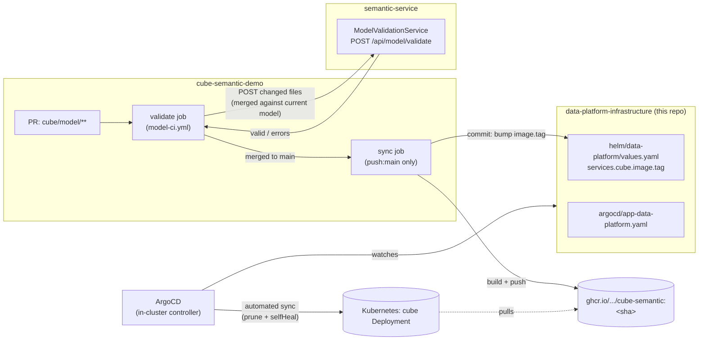

# Cube Model CI/CD + GitOps — High-Level Design (HLD)

Feature: a validate-before-merge, pull-based-deploy pipeline for the Cube.dev semantic model —
`cube-semantic-demo`'s CI sends every changed cube YAML file to `semantic-service` for
structural validation before it can reach `main`; once merged, CI's only remaining job is to
build an image and hand a commit to this repo; **ArgoCD**, not CI, applies it to the cluster.

- **Repos involved:** `cube-semantic-demo` (model source + CI), `semantic-service` (validation
  API), `data-platform-infrastructure` (this repo — Helm chart + ArgoCD `Application`)
- **New components:** `POST /api/model/validate` (semantic-service), `cube/Dockerfile` +
  `.github/workflows/model-ci.yml` (cube-semantic-demo), `services.cube` in the Helm chart +
  `argocd/app-data-platform.yaml` (this repo)

> Implementation detail (API contract, Helm values, ArgoCD spec, CI job graphs) lives in the
> companion **[LLD.md](./LLD.md)**.

---

## 1. Context & goals

| | |
|---|---|
| **Goal** | Catch structurally-broken Cube YAML (most concretely: two cubes/views sharing a `name` — the failure mode Cube.dev itself only surfaces at runtime, sometimes only after a container restart) *before* it merges, and deploy validated changes through a pull-based GitOps loop instead of CI running `kubectl`/`helm` against the cluster directly. |
| **Non-goal** | Re-implementing Cube.dev's own schema compiler (JS-level syntax/measure-formula errors are still Cube.dev's job); owning application-service (`semantic-service`/`chat-service`/`iam-service`/`data-platform-ui`) release pipelines — those still build images by hand today (see `helm/README.md`); multi-cluster/multi-region ArgoCD topologies. |
| **Trigger for this work** | The demo's Cube model has no automated gate at all: a duplicate cube `name` across two files only surfaces once Cube.dev is running, and Cube.dev's dev-mode "hot reload" doesn't cleanly recompile on structural changes — it needs a container restart to even show the *right* error. Validating pre-merge, against the *whole* model (not just the diff), removes the failure mode entirely instead of making it easier to recover from. |
| **Placement decision** | Validation logic lives in `semantic-service`, not as a CI-local script, because `semantic-service` already parses this exact YAML (`ModelFileService`, for `GET /api/model`) — reusing that parser is one source of truth for "what a valid cube looks like," not two that can drift. |

---

## 2. Architecture

### 2.1 Component / flow diagram

### 2.2 Data flow — the full loop

1. **PR opened** touching `cube/model/**`. `model-ci.yml`'s `validate` job runs on every PR
   (and again on every push to `main`, as a safety net for direct pushes / squash-merges).
2. **`validate` job**: diffs the changed files against the PR's base ref, POSTs their `{path,
   content}` to `semantic-service`'s `POST /api/model/validate`. The service merges those files
   into the *full current model* (read off disk via `ModelFileService`, the same source `GET
   /api/model` uses) and checks: YAML parses; every cube/view has `name`; **no two definitions —
   across ANY file, not just the ones in this PR — share a `name`**; every cube has `sql_table`
   or `sql`; every cube has a `primary_key: true` dimension; every `joins[].name` resolves.
   `valid: false` fails the CI job with the specific file + reason.
3. **Merge to `main`** (only possible once `validate` is a required check, configured in GitHub
   branch protection — out of scope of this repo, a `cube-semantic-demo` setting).
4. **`sync` job** (needs `validate`, `push:main` only): builds `cube/Dockerfile` (the model baked
   in — no bind mount, no hot-reload dependency at all) tagged `:<git-sha>`, pushes to GHCR,
   checks out **this repo**, bumps `services.cube.image.tag` to `<sha>`, commits, pushes.
   **This commit is CI's last action.** It never touches the cluster.
5. **ArgoCD** (already watching this repo via `argocd/app-data-platform.yaml`,
   `syncPolicy.automated`) detects the new commit within its poll interval (or a webhook, if
   configured), computes the diff against live cluster state, and applies it — the `cube`
   Deployment rolls to the new image.
6. Cube.dev serves the new model immediately (freshly started container, not a hot-reloaded
   one — sidesteps the restart-required bug entirely). `semantic-service`'s own 5-minute
   catalog-refresh cache (see `semantic-service/docs/HLD.md` §2.2) picks up the change on its
   next cycle, or instantly via its `POST /api/cubes/refresh` webhook if wired to the rollout.

### 2.3 Key design decisions (ADR-style)

| # | Decision | Why | Alternatives rejected |
|---|---|---|---|
| D1 | **Validate against the whole current model, not just the PR's diff** | A PR only sees its own changed files; two DIFFERENT PRs (or a PR against a file added since the branch was cut) can each be individually "valid" and still collide on `name` once both land. Merging the submission into the full on-disk model before checking catches this. | Validate each submitted file in isolation — cheaper, but doesn't catch the actual historical bug. |
| D2 | **Validation lives in `semantic-service`, not a CI shell script** | Reuses `ModelFileService`'s existing YAML parsing (one source of truth); CI stays a thin HTTP caller, easy to swap the validation implementation without touching the workflow. | Duplicate a YAML-shape checker in a CI-local Python/Node script. |
| D3 | **Bake the model into an immutable per-commit image, not a git-sync sidecar into a long-running pod** | Matches how the rest of the platform deploys (image + tag = the unit of change ArgoCD reconciles); avoids Cube.dev's dev-mode "hot reload doesn't cleanly recompile structural changes" bug entirely — every deploy is a fresh process, not a reload. | A sidecar that `git pull`s into a mounted volume and relies on Cube.dev's file-watcher; fights GitOps (the running pod's state depends on something outside the Application's declared image) and inherits the reload bug. |
| D4 | **CI's last action is a git commit, never `kubectl`/`helm` against the cluster** | The whole point of "GitOps via ArgoCD": the cluster's desired state lives in one place (this repo) that anyone can read, diff, and `git revert`; CI credentials never need cluster access at all. | Have CI's `sync` job run `helm upgrade` directly (simpler, but CI now needs cluster credentials, and `git log` on this repo stops being the full deploy history). |
| D5 | **A separate infra repo, not manifests inside each app's source repo** | One place ArgoCD watches regardless of which app changed; app CI pipelines only need write access to *this* repo (one shared token), not cluster credentials or knowledge of each other's chart. Also where `observability/` naturally lives, since it isn't scoped to one app either. | Manifests co-located in `cube-semantic-demo` itself — couples ArgoCD's watch scope to app source, and doesn't generalize to the other services' deploys. |
| D6 | **`syncPolicy.automated: {prune: true, selfHeal: true}`**, not manual `argocd app sync` | Pull-based GitOps only holds if reconciliation is automatic — manual sync reintroduces a human (or a second automation) as a required step between "commit lands" and "cluster matches." `selfHeal` also reverts any manual `kubectl edit` drift. | Manual sync, reviewed before apply — safer-feeling but is no longer really GitOps, and reintroduces exactly the kind of manual deploy step this work exists to remove. |
| D7 | **`services.cube` bundled into the shared Helm chart**, reversing the chart's prior "Cube stays external" note | The model is what this whole pipeline exists to deploy — it needs a real Kubernetes object for ArgoCD to reconcile. StarRocks/Postgres (what Cube *queries*) are unaffected and stay external; only Cube.dev's own process moved in-cluster. | A second, Cube-only Helm chart/ArgoCD Application — more moving parts for one Deployment; the shared chart's per-service `range` templates already generalize to it once `runAsNonRoot`/`extraPorts` were made per-service-overridable (see LLD.md §2). |

---

## 3. Non-functional characteristics

- **Correctness over speed on the validate path:** the ephemeral `semantic-service` +
  Redis the `validate` job stands up per-run costs \~30-60s of CI time; deemed worth it since the
  check is exactly the thing the model previously had zero automated coverage for.
- **Blast radius:** a bad model change can, at worst, reach `main` if `validate` is misconfigured
  as a non-required check — but even then, ArgoCD's `selfHeal` means a `git revert` on this repo
  (not a manual cluster fix) is always sufficient to recover.
- **Security:** `POST /api/model/validate` is gated at role `analyst` (same tier as
  `/api/cubes/refresh` — automation-facing, not a casual-browse endpoint); CI authenticates with
  a synthetic `X-Tenant-Id: ci` identity under the same trusted-gateway shim every other endpoint
  uses (see `semantic-service/docs/HLD.md` D2) — a real CI service-account token is future work,
  same limitation as the rest of the platform's RBAC today.
- **Auditability:** every deploy is a commit in this repo with a message linking back to the
  `cube-semantic-demo` commit that caused it (`sync` job, see LLD.md §3) — `git log` on this repo
  IS the deploy history, no separate deployment-tracking system needed.

---

## 4. Known limitations & future work

| Item | Note |
|---|---|
| **`validate` job builds `semantic-service` from source on every run** | No published `semantic-service` image exists yet (out of scope of this work — see `semantic-service`'s own repo). Costs CI time; swap for `docker pull` of a published tag once one exists. |
| **No webhook from ArgoCD/the cluster back to `semantic-service`'s `/api/cubes/refresh`** | Today the rollout is picked up by `semantic-service`'s existing 5-minute scheduled refresh, not instantly. Wiring a post-sync ArgoCD hook to call `/refresh` would close that gap — noted, not built. |
| **Single Cube replica, no horizontal scaling** | Matches Cube.dev dev-mode's single-instance assumption (in-memory pre-aggregation scheduling); moving to Cube Cloud or a multi-instance self-hosted setup would need re-checking this. |
| **`INFRA_REPO_TOKEN` is a long-lived PAT, not scoped per-workflow** | Fine for a demo; a GitHub App installation token (auto-expiring, repo-scoped) is the production-grade replacement. |
| **This repo's own changes aren't validated by any CI** | A bad Helm values edit here only surfaces when ArgoCD tries to sync it (or `helm lint` is run by hand, as was done while building this — see LLD.md §5). A `helm lint`-on-PR workflow for this repo itself is a natural next step, not built here. |

See **[LLD.md](./LLD.md)** for the API contract, Helm values reference, ArgoCD `Application`
spec, and both `model-ci.yml` job graphs as sequence diagrams.
