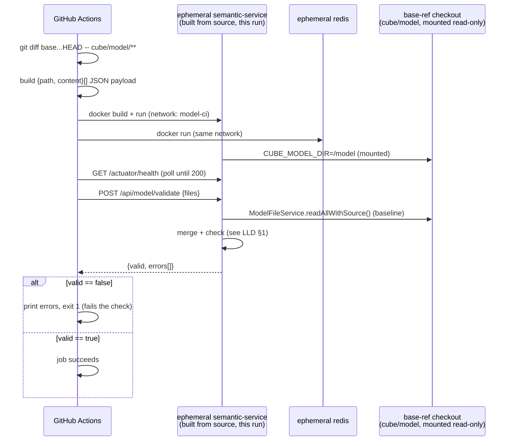
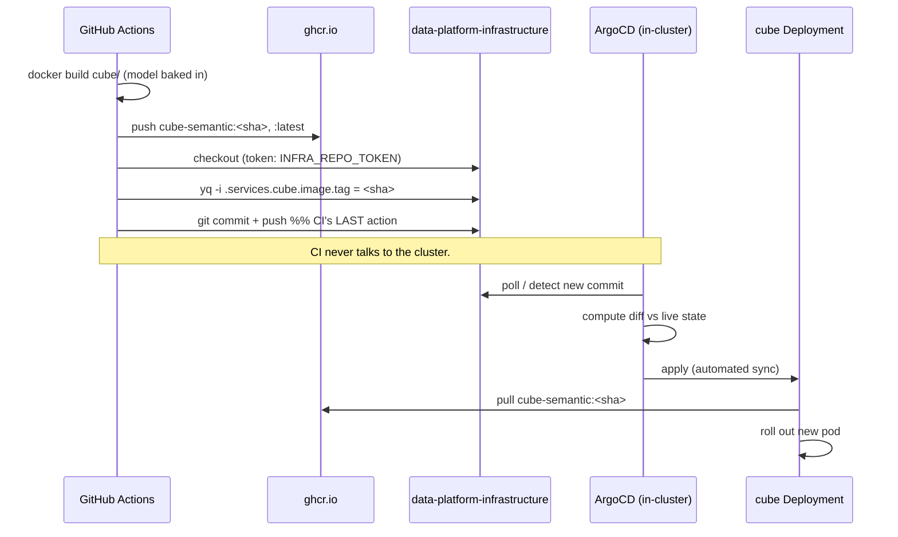

# Cube Model CI/CD + GitOps — Low-Level Design (LLD)

Implementation detail for the pipeline described in **[HLD.md](./HLD.md)**: the
`POST /api/model/validate` contract, the Helm values this repo adds, the ArgoCD `Application`
spec, and both `cube-semantic` CI jobs as sequence diagrams.

---

## 1. `POST /api/model/validate` — API contract

Lives in `semantic-service` (`io.semantic.semantic.controller.ModelController`,
`io.semantic.semantic.service.ModelValidationService`). Role: `analyst`.

**Request**
```json
{
  "files": [
    { "path": "cubes/orders_analytics.yml", "content": "cubes:\n  - name: orders_analytics\n    ..." }
  ]
}
```
`path` only needs to be unambiguous by filename (e.g. `cubes/orders.yml` or just `orders.yml`
both work) — matching is by filename against the on-disk model directory, not full path.

**Response — always HTTP 200; `valid` carries the outcome**
```json
{
  "valid": false,
  "errors": [
    { "file": "orders_analytics.yml",
      "message": "cube 'orders_analytics' duplicates the one already defined in orders.yml" }
  ],
  "warnings": []
}
```

**Checks performed** (`ModelValidationService.validate`):
1. Each submitted file's YAML must parse (SnakeYAML).
2. Every cube/view definition needs a `name`.
3. **No two definitions — across the merged (baseline + submitted) set — share a `name`.**
4. Every cube needs `sql_table` or `sql`.
5. Every cube needs at least one dimension with `primary_key: true`.
6. Every `joins[].name` must resolve to a cube/view present in the merged set.

**The merge**, `ModelFileService.readAllWithSource()` (new — extends the existing `readAll()`
used by `GET /api/model`, same package-visible `normalize()` reused by both):
```
baseline := on-disk model, keyed by name, each entry tagged with its source filename
for each submitted file:
    baseline := baseline WITHOUT entries whose source == this file's name   # "this file replaces itself"
for each submitted file (parsed):
    for each name defined in it:
        if name already in baseline → ERROR "duplicates the one already defined in <file>"
        else → add to baseline
run checks 4-6 over the full resulting baseline
```
This is why editing `orders.yml` to redefine `orders` is NOT flagged (baseline's `orders.yml`
entries are dropped before the check), while a **different** file defining a cube also named
`orders` IS flagged — the regression test for the bug this pipeline exists to catch
(`semantic-service/src/test/java/.../ModelValidationServiceTest.java`,
`duplicateAgainstBaselineIsRejected`).

---

## 2. Helm chart additions (`helm/data-platform/`)

### 2.1 `services.cube` (values.yaml)
```yaml
cube:
  enabled: true
  image:
    repository: ghcr.io/tuanphanduy/cube-semantic
    tag: ""                    # bumped by cube-semantic's CI to the git sha
  port: 4000                   # REST + GraphQL + Playground
  extraPorts:
    - { name: sql, port: 15432 }   # Cube SQL API — semantic-service's /sql-rewrite
  autoscaling: { enabled: false }  # Cube dev-mode is single-instance
  pdb: { enabled: false }
  probes: { type: http, path: /readyz, initialDelaySeconds: 20 }
  securityContext:
    runAsNonRoot: false        # upstream cubejs/cube image has no non-root user (confirmed:
                                # `docker run --entrypoint id cubejs/cube:latest` → uid=0)
  envSecret:
    CUBEJS_API_SECRET: CUBE_API_SECRET   # appSecret stores it under the OTHER services' key name
```

### 2.2 Template changes this required
- **`templates/deployment.yaml`**: `securityContext.runAsNonRoot` is now
  `{{ dig "securityContext" "runAsNonRoot" true $svc }}` (was hardcoded `true`) — every other
  service is unaffected (defaults to `true`), only `cube` overrides.
- **`templates/deployment.yaml` + `templates/service.yaml`**: new optional `$svc.extraPorts`
  (list of `{name, port}`) rendered as additional `containerPort`/Service `port` entries — every
  other service leaves this unset (no-op `range` over nil).
- **`templates/deployment.yaml`**: `env:` now merges plain `$svc.env` values with a new
  `$svc.envSecret` map (`name → secretKeyRef.key`), since `envFrom.secretRef` alone can't rename
  a Secret key to the env var name a specific image expects.

### 2.3 ConfigMap auto-rewrite (`templates/configmap.yaml`)
Same pattern already used for `redisHost`/`iamDbUrl`: when `services.cube.enabled`,
`semantic-service`'s `CUBE_API_URL`/`CUBE_SQL_URL` are rewritten to the in-cluster Service
(`http://<release>-cube:<port>/cubejs-api/v1`, `jdbc:postgresql://<release>-cube:15432/cube`)
instead of `config.cubeApiUrl`/`config.cubeSqlUrl` (which become pure external-Cube-Cloud
fallbacks, used only when `services.cube.enabled: false` — see `values-prod.yaml`'s Cube Cloud
example). Separately, `config.cubeDbType/cubeDbHost/cubeDbPort/cubeDbUser/cubeDbName` are new
keys surfaced as `CUBEJS_DB_*` — Cube's OWN connection to StarRocks, read only by the `cube` pod.

---

## 3. ArgoCD `Application` (`argocd/app-data-platform.yaml`)

```yaml
apiVersion: argoproj.io/v1alpha1
kind: Application
spec:
  source:
    repoURL: https://github.com/TuanPhanDuy/data-platform-infrastructure.git
    targetRevision: main
    path: helm/data-platform
    helm:
      valueFiles: [values.yaml, values-dev.yaml]   # values-prod.yaml for a real prod Application
  destination:
    server: https://kubernetes.default.svc
    namespace: data-platform
  syncPolicy:
    automated: { prune: true, selfHeal: true }
    syncOptions: [CreateNamespace=true]
```
`prune: true` means resources removed from the chart (e.g. disabling a service) are deleted from
the cluster, not just left orphaned. `selfHeal: true` means a manual `kubectl edit` on anything
this Application owns gets reverted on the next reconcile — the git state always wins.

---

## 4. `cube-semantic/.github/workflows/model-ci.yml` — sequence diagrams

### 4.1 `validate` job



### 4.2 `sync` job (needs: validate; push:main only)



---

## 5. Local verification performed while building this

No staging cluster exists yet, so the loop above was proven against a real local `kind` cluster
+ a real ArgoCD install (not just `helm template`/static lint) before anything was pushed:

```bash
kind create cluster --name data-platform
kubectl create namespace argocd
kubectl apply -n argocd -f https://raw.githubusercontent.com/argoproj/argo-cd/stable/manifests/install.yaml
kubectl -n argocd wait --for=condition=available --timeout=300s deploy/argocd-server

# Images built locally and loaded directly into kind's nodes — no registry push needed for this.
docker build -t cube-semantic:test cube/            # (from cube-semantic)
kind load docker-image cube-semantic:test --name data-platform
docker build -t semantic-service:test semantic-service/
kind load docker-image semantic-service:test --name data-platform

helm lint helm/data-platform -f helm/data-platform/values-dev.yaml
kubectl apply -f argocd/app-data-platform.yaml
kubectl get application data-platform -n argocd -w   # until Synced + Healthy

kubectl -n data-platform port-forward svc/dp-cube 14000:4000 &
curl -s http://localhost:14000/cubejs-api/v1/meta | jq '.cubes | length, map(.name) | group_by(.) | map(select(length>1))'
# → 7 cubes, zero duplicate names — the original bug this pipeline exists to prevent, verified
#   end-to-end from a real (if local) ArgoCD-managed rollout, not just the validation endpoint.
```
See `HLD.md` §4 for what was explicitly deferred (no real GHCR push, no live GitHub Actions run)
and why.
